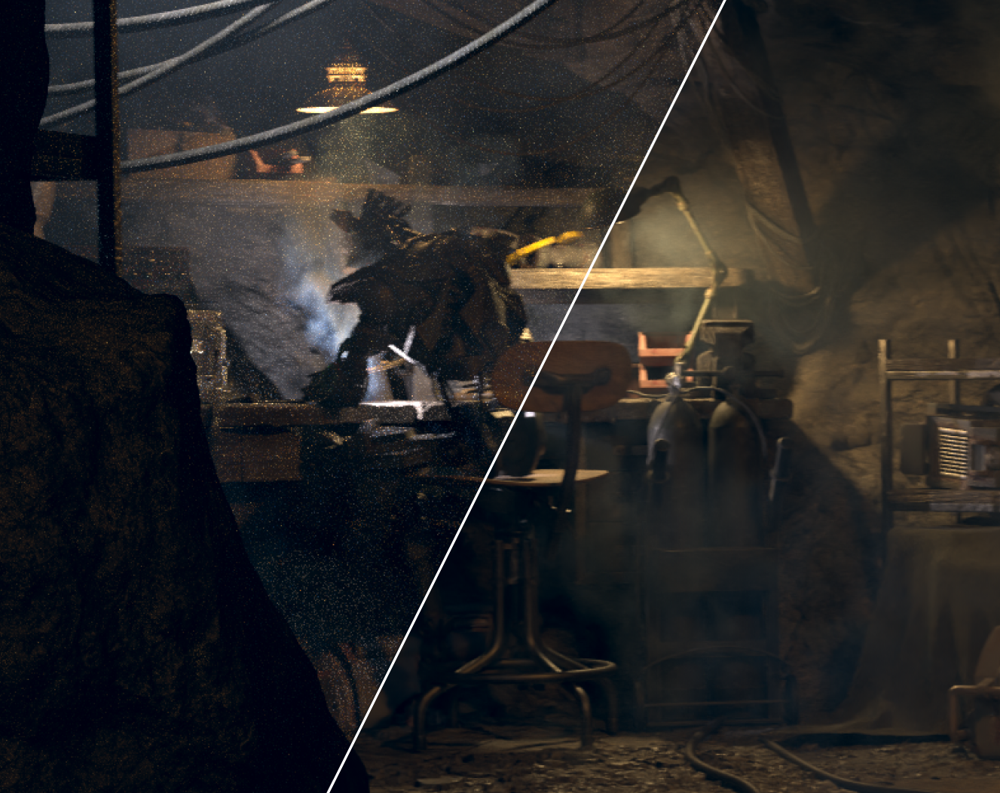

<h1 align="center">🪄 CG Denoiser</h1>

  
  

A **Nuke Plugin** for high-quality denoising of CG renders using **Intel Open Image Denoise (OIDN)** and **NVIDIA OptiX**.

Designed for production workflows with support for auxiliary buffers such as **albedo**, **normal**, and **motion vectors** (OptiX temporal).

---

## ✨ Features

- 🎯 High-quality denoising for CG renders
- ⚡ Dual backend support:
  - Intel OIDN (CPU / GPU depending on build)
  - NVIDIA OptiX (GPU accelerated)
- 🧠 Temporal denoising support (OptiX)
- 🎨 Auxiliary buffers:
  - Albedo
  - Normal
  - Motion vectors (for temporal stability)
- 🔧 Configurable quality, device, and filtering modes

---

## 🧩 Supported Versions

- **Nuke 17.0v1**
- **Nuke 16.0v2**

Other versions may be suported, however some manual fixing will be needed.

---

## 📦 Installation

See `BUILDING.md` for information about installating.

## 🧠 Usage

### Inputs

All inputs at the moment require being shuffled into RGB space. You will also need to denoise and copy the Alpha over seperately.

| Input   | Description                                      |
|---------|--------------------------------------------------|
| `color` | Main beauty render                               |
| `albedo`| Diffuse albedo pass (optional)                   |
| `normal`| World or camera space normals (optional)         |
| `motion`| Motion vectors (required for temporal OptiX)     |

### Settings

| Setting  | Type        | Description                          |
|----------|------------|--------------------------------------|
| `Engine` | Enumeration | The technique used for denoising     |

| Setting            | Type        | Description |
|--------------------|------------|-------------|
| `Device`      | Enumeration | The hardware backend used for OIDN denoising |
| `Filter`      | Enumeration | The filter method used for OIDN denoising |
| `Quality`     | Enumeration | Image quality |
| `Mode`        | Enumeration | Input image encoding. Use HDR unless the input is sRGB (2.2 gamma) or linear, in which case use sRGB. Output follows the same encoding |
| `Clean Aux`       | Boolean     | Denoise auxiliary features (albedo, normal) |
| `Input Scale`  | Float       | Scales input values before filtering without affecting output range. Useful for mapping HDR values to expected ranges |
| `Directional` | Boolean     | Indicates input contains normalized directional lightmap coefficients (typically in [-1, 1]) |

| Setting        | Type        | Description |
|----------------|------------|-------------|
| `Model`  | Enumeration | The method used for OptiX denoising. Temporal mode requires motion vectors |
| `Blend`  | Float       | Denoising strength. 1.0 = fully denoised |

### Issues

If you come across any Issues / Bugs, or are able to build the plugin for other versions of Nuke, please [Create an Issue](https://github.com/cjhosken/CGDenoiser/issues).

## 📄 License

This project was created under the MIT license.

## 👤 Author

Special thanks to [https://github.com/mateuszwojt/NukeCGDenoiser](https://github.com/mateuszwojt/NukeCGDenoiser) and [https://github.com/twins-annning/NukeOIDNDenoise](https://github.com/twins-annning/NukeOIDNDenoise) for the launching off point for this project. Without your code I definitely woudn't have made it this far.